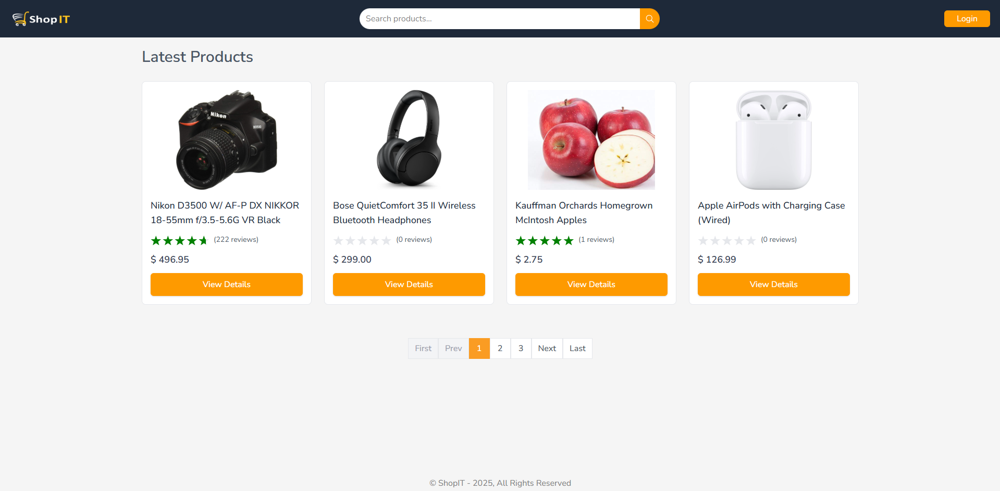
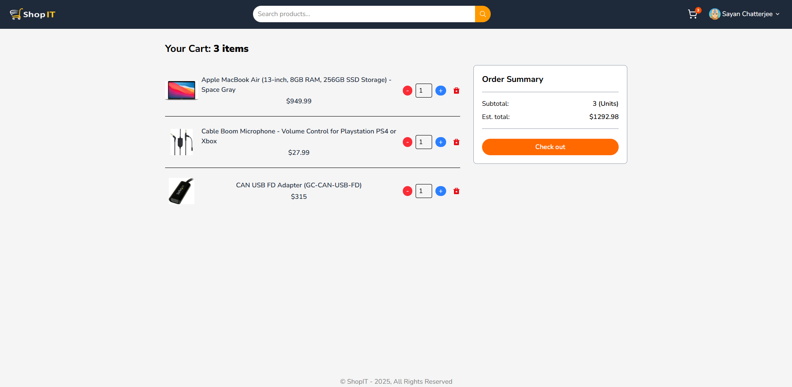
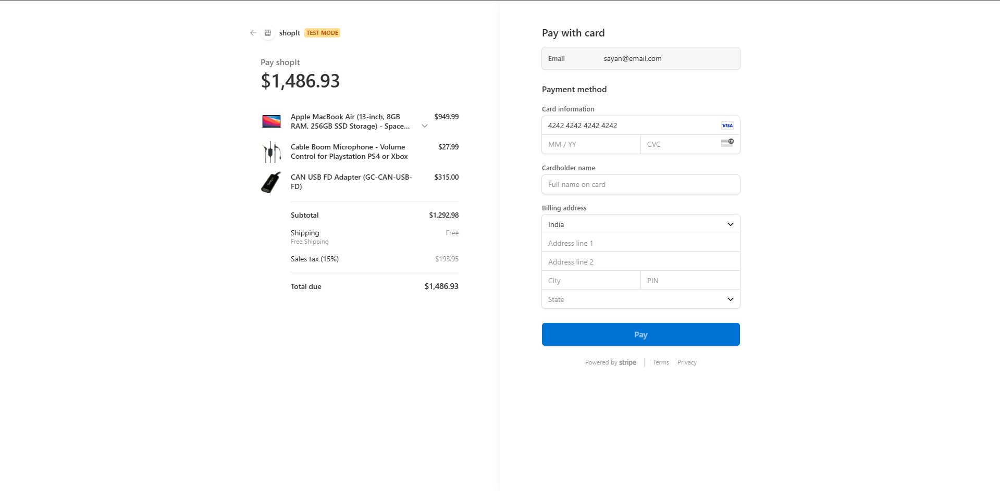
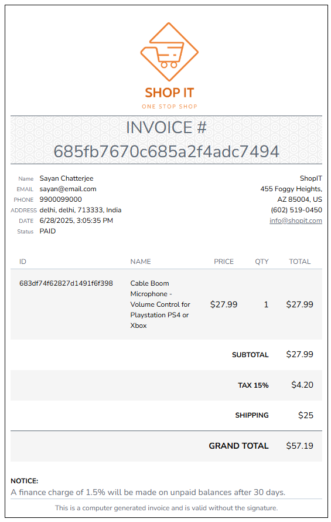
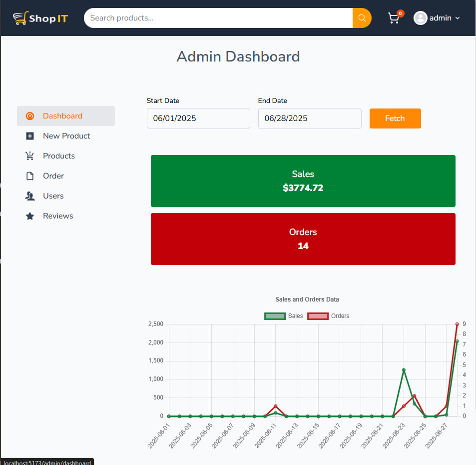

# 🛒 ShopIt – Full-Stack MERN E-Commerce App

ShopIt is a robust e-commerce application built using the **MERN stack** (MongoDB, Express, React, Node.js) and powered by **Redux Toolkit** and **RTK Query** for state and data management. It includes Stripe integration for secure payments, PDF invoice generation, admin analytics, and more.

---

### 🔥 Features

#### 💻 Frontend (React + Redux Toolkit)

- 🚀 **Redux Toolkit & RTK Query** for global state management and API handling
- 🔍 **Search, Pagination, and Filters** by price, category, and ratings
- 📓 **Product Reviews** and star ratings
- 🔐 **Authentication** with protected routes
- 🔁 **Forgot & Reset Password** flow
- 🛒 **Cart & Checkout** with **Cash on Delivery (COD)** support
- 💳 **Stripe Payment Integration**
- 📄 **PDF Invoice Generation and Download** (via `jspdf` and `html2canvas`)
- 📈 **Charts and Visuals** using `chart.js` and `react-chartjs-2`
- 🧑‍💼 **Admin Dashboard**

  - Product & user management
  - Order tracking and control
  - **Sales Analytics Charts**

#### 🛠 Backend (Node.js + Express)

- ✅ **JWT-based Authentication & Role-based Authorization**
- 🔒 **Secure Routes** using middleware
- 📧 **Password Reset via Email** using `nodemailer` with Mailtrap (for dev testing)
- 🗂️ **File Uploads** with `multer` and `cloudinary`
- 📦 **CRUD Operations** for products, orders, users, and reviews
- 🌍 **CORS Support** for cross-origin requests
- 🌐 **Environment Configuration** using `dotenv`

---

### 🛠️ Tech Stack

- **Frontend:** React, Redux Toolkit, RTK Query, React Router, Tailwind CSS
- **Backend:** Node.js, Express.js, JWT, Nodemailer, Multer, Cloudinary
- **Database:** MongoDB with Mongoose
- **Authentication:** JWT (JSON Web Tokens)
- **Payments:** Stripe API
- **Email Service:** Mailtrap (via `nodemailer`)
- **PDF & Invoice Generation:** `jspdf`, `html2canvas`
- **Charting Library:** `chart.js`, `react-chartjs-2`
- **Developer Tools:** Vite, ESLint, Nodemon

---

### ⚙️ Installation & Setup

#### 1. Clone the Repository

```bash
git clone https://github.com/chattsayan/shopIt-e-comm-app.git
cd shopIt-e-comm-app
```

#### 2. Install Dependencies

```bash
# Backend
npm install

# Frontend
cd ../frontend
npm install
```

#### 3. Configure Environment Variables

Create a `.env` file in both `backend/` (outside) and `frontend/` directories.

##### Example `.env` for Backend

```env
PORT=5000
DB_CONNECTION_STRING=your_mongodb_connection_string
JWT_SECRET=your_jwt_secret
JWT_EXPIRE_TIME=set_any_time
COOKIE_EXPIRE_TIME=set_any_time
CLOUDINARY_CLOUD_NAME=your_cloud_name
CLOUDINARY_API_KEY=your_key
CLOUDINARY_API_SECRET=your_secret
STRIPE_SECRET_KEY=your_stripe_secret
STRIPE_WEBHOOK_SECRET=your_stripe_webhook_secret
FREE_SHIPPING=your_stripe_free_shipping_rates
CHARGED_SHIPPING=your_stripe_delivery_shipping_rates
TAX_RATE=your_stripe_tax_rates
SMTP_HOST=smtp.mailtrap.io
SMTP_PORT=2525
SMTP_USERNAME=your_mailtrap_user
SMTP_PASSWORD=your_mailtrap_pass
SMTP_FROM_EMAIL=noreply@<your_domain_name>.com
SMTP_FROM_NAME=your_domain_name
```

#### 4. Run the Application

##### Development Mode

```bash
# In backend/
npm run dev

# In frontend/
npm run dev
```

---

### 🧰 Sample Admin Credentials

> Default admin credentials (if seeded manually):

```
Admin_Email: admin@email.com
Password: 1234567

User_Email: sayan@email.com
Password: 123456
```

---

### 📊 Admin Dashboard Features

- View all users, orders, products
- Create/edit/delete products
- View **sales charts** and analytics
- Filter orders by status

---

### 📸 Screenshots

_Add a few screenshots here of the home page, product page, cart, checkout, invoice, and admin dashboard._

- HOMEPAGE:
  

- CART:
  

- CHECKOUT:
  

- INVOICE:
  

- ADMIN DASHBOARD:
  

---

### 🤝 Contribution

Contributions, issues, and feature requests are welcome!
Feel free to check the [issues page](https://github.com/chattsayan/shopIt-e-comm-app/issues) or submit a PR.

---

### 📜 License

This project is licensed under the MIT License.

---

### 🙋‍♂️ Author

**Sayan Chatterjee**
[GitHub: @chattsayan](https://github.com/chattsayan)
Reach out for collaboration, freelance projects, or feedback!
